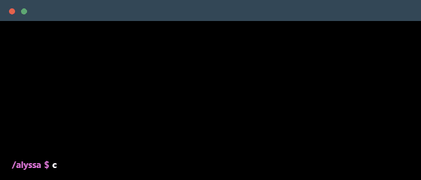

    

## ✨ About Me

I'm a Computer Science student at Ateneo de Davao University with a passion for web development, cloud computing, and design. As an SM Foundation Scholar maintaining a 3.91 GPA, I'm dedicated to both technical excellence and creative problem-solving. When I'm not coding, you can find me contributing to the tech community through organizations like DurianPy and AWS User Group Davao.

### Main skills

### Studying

## 📈 GitHub Stats

  

## 🏆 Certifications & Achievements

- **AWS Certified Cloud Practitioner** (2025)
- **Civil Service Professional Eligibility** (2024)
- **SM Foundation Scholar** - maintaining 3.91 GPA

## 👥 Leadership & Community

- **NASA Space Apps Challenge Davao 2025** - Local Lead
- **Samahan Systems and Development** - Dev Lead & Frontend Developer
- **PyCon Asia-Pacific 2025** - Stagehand Committee & Web Designer
- **DurianPy** - Creatives Lead
- **AWS User Group Davao** - Photographer & Creatives
- **Google Developer Group Davao** - Design Lead for I/O Extended 2024
- **Atenews** - Web Developer

## 🔗 Connect With Me

  
  
  
  

